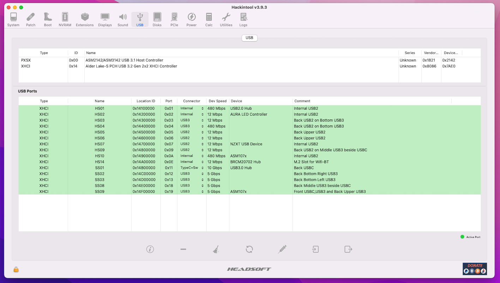

# Hackintosh 13600k-Asus-B660M-Wifi-Plus

# macOS Version: macOS Ventura 13.2.1

# Hardware
CPU: i5-13600k
Board: Asus B660M Wifi Plus
RAM: 32 GB (2x16GB) Kingston DDR5 6000Mhz CL32
GPU: MSI Gaming Trio X 6900 XTX
PSU: Corsair SF750
Case: Asus AP201 (Micro-ATX)
Wifi/BT: BCM94360NG (replaces the m.2 Intel AX201 that is preinstalled)

# Working
- CPU Power Management
- USB Ports
- Sleep/Wake
- Wifi/BT

# Not working
- iGPU UHD770 is not supported by macOS

# USB Port Mapping

